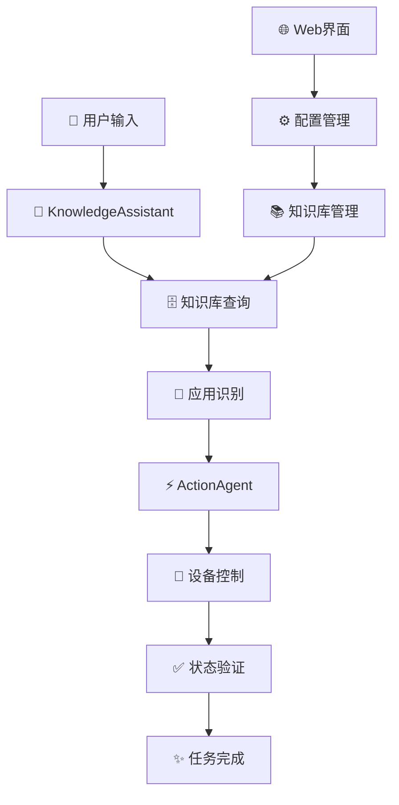

# 📱 NebulaAgent(星云AGENT)

<div align="center">


**🤖 基于AI的智能手机自动化助手**

*通过自然语言控制Android设备，让手机操作更智能、更便捷*

[](https://python.org)
[](LICENSE)
[](https://android.com)

**由[云锦微](https://www.viitrix.com)提供技术支持**


### 🎬 演示视频

[Bilibili](https://www.bilibili.com/video/BV1T2abz4EjT/)
</div>
## 📖 项目简介

NebulaAgent 是一个革命性的AI驱动的Android设备自动化解决方案。它将先进的自然语言处理技术与设备控制相结合，让用户能够通过简单的中文或英文指令来控制Android设备执行复杂的操作任务。

### 🌟 核心亮点

- 🗣️ **自然语言交互** - 无需学习复杂命令，用日常语言描述您的需求
- 🧠 **智能应用识别** - 自动识别并启动合适的应用程序
- 🔄 **步骤化执行** - 将复杂任务分解为可执行的简单步骤
- ✅ **实时状态验证** - 确保每个操作步骤正确执行
- 📚 **知识库驱动** - 内置应用操作知识，支持手动添加

## ✨ 功能特性

<details>
<summary><strong>🎯 智能任务执行</strong></summary>

- **🗣️ 自然语言交互**: 支持中文和英文指令，理解用户意图
- **🤖 自动应用识别**: 智能分析任务需求，自动选择合适的应用
- **⚡ 步骤化执行**: 复杂任务自动分解为可执行的操作序列
- **✅ 状态验证**: 每步操作后自动验证执行结果，确保任务完成

</details>

<details>
<summary><strong>📚 知识库管理</strong></summary>

- **📖 应用文档库**: 内置常用应用的详细操作指南和帮助文档
- **🔍 语义搜索**: 基于向量化的智能搜索，快速定位相关操作
- **🧠 持续学习**: 支持手动添加新应用知识和操作经验
- **📊 数据管理**: 可视化管理应用数据和文档内容

</details>

<details>
<summary><strong>🛠️ 设备控制</strong></summary>

- **🔌 ADB集成**: 通过Android Debug Bridge实现底层设备控制
- **📱 多设备支持**: 自动检测并管理多个连接的Android设备
- **👆 UI交互**: 支持点击、滑动、长按、输入等全面的交互操作
- **👁️ 屏幕分析**: 实时解析屏幕内容和UI元素结构

</details>

<details>
<summary><strong>🌐 可视化配置</strong></summary>

- **💻 Web管理界面**: 基于Streamlit的现代化配置管理界面
- **⚙️ 统一配置**: 集中管理API密钥、模型设置和系统参数
- **📥📤 数据交换**: 支持批量导入导出应用数据和文档
- **📊 实时监控**: 实时查看系统运行状态和数据库信息

</details>

## 🚀 快速开始

### 📋 系统要求

| 组件 | 版本要求 | 说明 |
|------|----------|------|
| **Python** | 3.10+ | 主要开发语言 |
| **Android设备** | API 21+ | 需开启USB调试模式 |
| **ADB工具** | 最新版本 | Android Debug Bridge |
| **操作系统** | Windows/macOS/Linux | 跨平台支持 |

### 🔧 安装指南

#### 1️⃣ 获取项目代码

```bash
# 克隆仓库
git clone https://github.com/NebulaMao/NebulaAgent.git
cd NebulaAgent
```

#### 2️⃣ 环境准备

```bash
# 方法一：使用 uv（推荐，更快的包管理器）
uv sync

# 方法二：使用传统 pip
pip install streamlit pandas numpy openai requests fastmcp python-dotenv
```

#### 3️⃣ 设备连接

```bash
# 1. 确保Android设备已连接并开启USB调试
# 2. 验证设备连接状态
adb devices

# 应该看到类似输出：
# List of devices attached
# [device_id]    device
```

#### 4️⃣ 启动配置界面

```bash
# 启动Web配置界面
./start_ui.sh

# 或者直接运行
streamlit run main_ui.py
```

#### 5️⃣ 完成系统配置

1. 在浏览器中访问 `http://localhost:8501`
2. 配置以下必要参数：
   - **OpenAI Base URL**: API服务地址
   - **OpenAI API Key**: API访问密钥
   - **Actions Model**: 动作执行模型（默认：`zai-org/glm-4.5`）
   - **ADB Path**: ADB工具路径（默认：`adb`）

#### 6️⃣ 运行主程序

```bash
# 启动NebulaAgent
python main.py
```

### 🎉 首次使用

启动后，您可以尝试以下示例指令：

```
💬 "帮我发一条朋友圈：今天天气真好！"
💬 "打开微信并给张三发消息"  
💬 "帮我设置一个明天早上7点的闹钟"
💬 "打开支付宝查看余额"
```

## 💻 使用示例

### 📱 基础操作示例

<table>
<tr>
<td width="50%">

**📝 社交应用操作**
```
🗣️ "帮我发一条朋友圈：今天心情不错！"
🗣️ "给李四发微信：会议延迟到下午3点"
🗣️ "在微博发一条动态：分享今天的美食"
```

</td>
<td width="50%">

**⏰ 系统设置操作**
```
🗣️ "设置明天早上7点的闹钟"
🗣️ "打开WiFi设置"
🗣️ "调整屏幕亮度到最大"
```

</td>
</tr>
<tr>
<td>

**🛒 电商购物操作**
```
🗣️ "在淘宝搜索iPhone 15"
🗣️ "打开支付宝查看余额"
🗣️ "帮我下单购买这个商品"
```

</td>
<td>

**🎵 娱乐应用操作**
```
🗣️ "在抖音搜索搞笑视频"
🗣️ "播放网易云音乐"
🗣️ "截图并保存到相册"
```

</td>
</tr>
</table>

### 🔧 高级配置示例

```bash
# 开发者模式启动（详细日志）
streamlit run main_ui.py --server.runOnSave=true --server.enableCORS=false --logger.level=debug

# 检查当前配置状态
python config_loader.py

# 使用自定义端口启动
streamlit run main_ui.py --server.port 8502
```

## ⚙️ 配置详解

### 🌍 环境变量配置

| 变量名 | 必需 | 默认值 | 说明 | 示例 |
|--------|:----:|--------|------|------|
| `openai_baseurl` | ✅ | - | AI模型API服务地址 | `https://api.openai.com/v1` |
| `openai_key` | ✅ | - | API访问密钥 | `sk-xxx...` |
| `actions_model` | ✅ | `zai-org/glm-4.5` | 动作执行模型名称 | `gpt-4` |
| `ADB_PATH` | ✅ | `adb` | ADB工具路径 | `/usr/local/bin/adb` |
| `db_path` | ❌ | `mobile_agent_help.db` | 知识库文件路径 | `./data/knowledge.db` |

### 📂 配置文件优先级

NebulaAgent 支持多种配置方式，按优先级从高到低排列：

```
1. 🔧 运行时环境变量 （最高优先级）
   ↓
2. 📄 .env 文件配置
   ↓  
3. 📋 config.json 文件 （最低优先级）
```

### 📝 配置文件示例

**`.env` 文件示例：**
```env
# AI模型配置
openai_baseurl=https://your-api-server.com/v1
openai_key=sk-your-api-key-here
actions_model=zai-org/glm-4.5

# 设备控制配置  
ADB_PATH=/usr/local/bin/adb

# 数据库配置
db_path=./data/mobile_agent_help.db
```

**`config.json` 文件示例：**
```json
{
  "openai_baseurl": "https://your-api-server.com/v1",
  "openai_key": "sk-your-api-key-here", 
  "actions_model": "zai-org/glm-4.5",
  "ADB_PATH": "adb",
  "db_path": "mobile_agent_help.db"
}
```

## 🏗️ 项目架构

### 📁 目录结构

```
NebulaAgent/
├── 📂 core/                          # 🔧 核心功能模块
│   ├── 📂 Agent/                     # 🤖 AI助手模块
│   │   ├── 📄 KnowledgeAssistant.py  # 🧠 知识库助手
│   │   └── 📄 ActionAgent.py         # ⚡ 动作执行助手
│   ├── 📂 Base/                      # 🏗️ 基础组件
│   │   ├── 📄 AgentBase.py           # 🎯 代理基类
│   │   ├── 📄 JsonUtil.py            # 🔧 JSON工具类
│   │   └── 📄 vector_db.py           # 🗄️ 向量数据库
│   └── 📄 phone.py                   # 📱 设备控制核心
├── 📄 config_loader.py               # ⚙️ 配置加载器
├── 📄 main_ui.py                     # 🌐 Web配置界面
├── 📄 main.py                        # 🚀 主程序入口
├── 📄 knowledge_manager.py           # 📚 知识库管理器
├── 📄 start_ui.sh                    # 🏃 启动脚本
├── 📂 static/                        # 🎨 静态资源
│   └── 🖼️ logo.png                   # 📷 项目Logo
├── 📄 pyproject.toml                 # 📦 项目配置
├── 📄 config.json                    # ⚙️ 配置文件
└── 📄 README.md                      # 📖 项目文档
```

### 🔗 核心组件关系



### 🧩 关键组件说明

| 组件 | 职责 | 主要功能 |
|------|------|----------|
| **📱 Phone类** | 设备控制核心 | ADB包装、UI交互、屏幕分析 |
| **🧠 KnowledgeAssistant** | 知识查询助手 | 知识库检索、应用识别、任务理解 |
| **⚡ ActionAgent** | 任务执行引擎 | 自动化操作、步骤分解、状态管理 |
| **⚙️ 配置系统** | 环境管理 | 参数配置、环境变量、设置验证 |
| **🌐 Web界面** | 可视化管理 | 配置界面、数据管理、监控面板 |

## � 支持的应用

### 🔥 支持应用列表

> 💡 **征集贡献者**: 以下应用的操作指南需要社区贡献！欢迎提交PR添加详细的操作文档。

<table>
<tr>
<th width="20%">分类</th>
<th width="25%">应用名称</th>
<th width="30%">包名</th>
<th width="15%">状态</th>
<th width="10%">贡献</th>
</tr>
<tr>
<td rowspan="2"><strong>📞 社交通讯</strong></td>
<td>🟢 微信</td>
<td><code>com.tencent.mm</code></td>
<td>🟡 需要文档</td>
<td><a href="#contribute">贡献</a></td>
</tr>
<tr>
<td>🔵 QQ</td>
<td><code>com.tencent.mobileqq</code></td>
<td>🟡 需要文档</td>
<td><a href="#contribute">贡献</a></td>
</tr>
<tr>
<td rowspan="2"><strong>💰 支付购物</strong></td>
<td>🔵 支付宝</td>
<td><code>com.eg.android.AlipayGphone</code></td>
<td>🟡 需要文档</td>
<td><a href="#contribute">贡献</a></td>
</tr>
<tr>
<td>🟠 淘宝</td>
<td><code>com.taobao.taobao</code></td>
<td>🟡 需要文档</td>
<td><a href="#contribute">贡献</a></td>
</tr>
<tr>
<td><strong>🎵 娱乐媒体</strong></td>
<td>⚫ 抖音</td>
<td><code>com.ss.android.ugc.aweme</code></td>
<td>🟡 需要文档</td>
<td><a href="#contribute">贡献</a></td>
</tr>
<tr>
<td rowspan="3"><strong>🛒 其他常用</strong></td>
<td>📱 小红书</td>
<td><code>com.xingin.xhs</code></td>
<td>📋 待添加</td>
<td><a href="#contribute">贡献</a></td>
</tr>
<tr>
<td>🎬 哔哩哔哩</td>
<td><code>tv.danmaku.bili</code></td>
<td>📋 待添加</td>
<td><a href="#contribute">贡献</a></td>
</tr>
<tr>
<td>🍕 美团</td>
<td><code>com.sankuai.meituan</code></td>
<td>📋 待添加</td>
<td><a href="#contribute">贡献</a></td>
</tr>
</table>

### 🔧 添加新应用支持

您可以通过以下方式为NebulaAgent添加更多应用支持：

#### 方法一：Web界面添加（推荐）
1. 访问配置界面 `http://localhost:8501`
2. 进入「应用管理」页面
3. 点击「添加新应用」
4. 填写应用信息：
   - 应用名称
   - 包名（Package Name）
   - 操作文档
   - 使用说明

#### 方法二：知识库导入
```bash
# 使用知识库管理器添加应用文档
python knowledge_manager.py --add-app "应用名称" --package "包名" --docs "操作文档路径"
```

### 📈 支持程度说明

| 状态 | 标识 | 说明 |
|------|------|------|
| **完全支持** | ✅ | 全面的操作文档，支持复杂任务自动化 |
| **需要文档** | 🟡 | 基本框架已有，急需操作指南贡献 |
| **实验性支持** | 🧪 | 试验阶段，功能有限 |
| **待添加** | 📋 | 等待社区贡献应用支持 |

### 🤲 征集操作指南贡献 {#contribute}

**📢 我们急需您的帮助！** 

目前系统框架已经完善，但各个应用的详细操作指南还需要社区贡献。您的贡献将帮助成千上万的用户更好地使用NebulaAgent！

#### 🎯 优先贡献应用

以下应用使用频率最高，急需操作指南：

<table>
<tr>
<th>应用</th>
<th>所需文档</th>
<th>难度</th>
<th>预估工作量</th>
</tr>
<tr>
<td><strong>🟢 微信</strong></td>
<td>发消息、朋友圈、支付、群聊管理</td>
<td>⭐⭐⭐</td>
<td>2-3小时</td>
</tr>
<tr>
<td><strong>🔵 支付宝</strong></td>
<td>转账、付款码、生活缴费、理财</td>
<td>⭐⭐</td>
<td>1-2小时</td>
</tr>
<tr>
<td><strong>🟠 淘宝</strong></td>
<td>搜索商品、下单、查看订单</td>
<td>⭐⭐⭐</td>
<td>2-3小时</td>
</tr>
<tr>
<td><strong>⚫ 抖音</strong></td>
<td>搜索视频、点赞评论、发布视频</td>
<td>⭐⭐</td>
<td>1-2小时</td>
</tr>
</table>

#### 📝 操作指南模板

贡献操作指南时，请参考以下模板：

```markdown
# [应用名称] 操作指南

## 基本信息
- 应用名称：[中文名称]
- 包名：[package_name]
- 版本要求：[最低支持版本]

## 核心功能操作

### 1. [功能名称，如：发送消息]
**触发词**: "发消息", "发微信", "联系"
**操作步骤**:
1. 打开应用
2. 点击搜索或联系人
3. 选择目标联系人
4. 输入消息内容
5. 点击发送

**UI元素定位**:
- 搜索框: `resource-id="com.tencent.mm:id/search"`
- 发送按钮: `text="发送"`

**常见问题**:
- 问题描述和解决方案

### 2. [其他功能...]
```

#### 🚀 快速开始贡献

1. **📋 选择应用**: 从上表中选择一个您熟悉的应用
2. **🔍 分析界面**: 使用ADB工具分析应用UI结构
3. **📝 编写文档**: 按照模板编写操作指南
4. **🧪 测试验证**: 在NebulaAgent中测试您的指南
5. **📤 提交贡献**: 通过PR提交您的操作指南

#### 💡 贡献奖励

为了感谢贡献者，我们提供：
- 🏆 **贡献者徽章**: 在README中展示您的贡献
- 📚 **技术成长**: 深入了解AI自动化和移动应用分析
- 🌟 **开源影响力**: 帮助更多用户，提升个人开源项目影响力
- 🎁 **特别感谢**: 重要贡献者将获得项目特别感谢

## 🛠️ 开发指南

### 👨‍💻 为开发者

#### 🔌 添加新应用支持

<details>
<summary><strong>📋 步骤详解</strong></summary>

1. **📊 应用分析**
   ```bash
   # 获取应用包名
   adb shell pm list packages | grep "应用关键词"
   
   # 分析应用界面结构
   adb shell uiautomator dump
   ```

2. **📝 文档编写**
   - 创建应用操作指南
   - 定义常用操作步骤
   - 编写UI元素定位方法

3. **🧪 功能测试**
   - 在Web界面添加应用信息
   - 测试知识库搜索功能
   - 验证自动化操作流程

4. **✅ 集成验证**
   - 端到端测试完整流程
   - 性能和稳定性测试
   - 文档和示例完善

</details>

#### 🚀 扩展核心功能

<details>
<summary><strong>🔧 开发方向</strong></summary>

- **🤖 AI模型集成**: 支持更多AI模型和API服务
- **🎯 操作精度提升**: 增强UI元素识别和定位精度
- **📊 分析能力**: 扩展屏幕内容理解和分析能力
- **🔍 搜索算法**: 优化知识库搜索和匹配算法
- **⚡ 性能优化**: 提升响应速度和资源利用效率

</details>

### 🤝 贡献指南

我们欢迎社区贡献！请按以下流程参与：

#### 🔄 标准流程
```bash
# 1. Fork 项目到个人仓库
git clone https://github.com/your-username/NebulaAgent.git

# 2. 创建功能分支
git checkout -b feature/your-feature-name

# 3. 开发和测试
# ... 进行开发工作 ...

# 4. 提交更改
git add .
git commit -m "feat: 添加新功能描述"

# 5. 推送分支
git push origin feature/your-feature-name

# 6. 创建 Pull Request
```

#### 📝 提交规范
我们使用 [Conventional Commits](https://conventionalcommits.org/) 规范：

- `feat:` 新功能
- `fix:` 错误修复
- `docs:` 文档更新
- `style:` 代码格式调整
- `refactor:` 代码重构
- `test:` 测试相关
- `chore:` 构建过程或辅助工具的变动

## 🐛 故障排除

### 常见问题

1. **设备连接失败**
   ```bash
   # 检查ADB连接
   adb devices
   
   # 重新连接设备
   adb kill-server
   adb start-server
   ```

2. **配置加载失败**
   ```bash
   # 检查配置文件
   cat config.json
   
   # 重新配置
   python config_loader.py
   ```

3. **应用启动失败**
   ```bash
   # 检查应用是否安装
   adb shell pm list packages [package_name]
   
   # 查看错误日志
   adb logcat
   ```

4. **Web界面无法访问**
   ```bash
   # 更换端口
   streamlit run streamlit_config.py --server.port 8502
   
   # 检查防火墙设置
   sudo ufw status
   ```

### 调试模式
```bash
# 启用详细日志
export PYTHONPATH=$PYTHONPATH:.
python main.py

# Streamlit调试模式
streamlit run streamlit_config.py --logger.level=debug
```

## 📄 许可证

本项目采用 MIT 许可证 - 查看 [LICENSE](LICENSE) 文件了解详情。

## 🤝 支持

如果您在使用过程中遇到问题或有改进建议，请：

1. 查看 [FAQ](docs/FAQ.md)
2. 提交 [Issue](issues)
3. 查看 [Wiki](wiki)

---

**让AI为您的智能手机生活带来便利！** 🎉

Made with ❤️ using Python, Streamlit, and AI